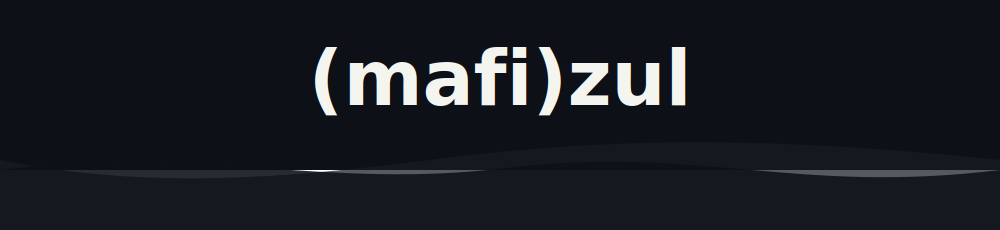
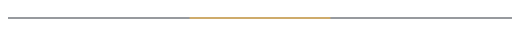

 

 
 

 

<i>
not the cleverest lines of code, 
not the tallest towers of abstraction, 
just the ones that name a crisis before it spreads, 
that hand a decision-maker one clear truth 
from a million scattered signals. 
 
i build what matters.
</i>

 

 

<code>United Nations</code> &nbsp;·&nbsp; <code>Peacekeeping</code> &nbsp;·&nbsp; <code>Human Rights</code> &nbsp;·&nbsp; <code>Data & AI</code> &nbsp;·&nbsp; <code>Africa</code>

 
 

&nbsp;&nbsp;&nbsp;&nbsp;&nbsp;&nbsp;&nbsp;&nbsp;&nbsp;&nbsp;&nbsp;&nbsp;&nbsp;&nbsp;

 

<code>i do not code for stats. i code for the moment when one clear signal changes the room.</code>

 
 

  
<code>credentials folded small</code>

   
  
    <code>Microsoft Certified: Data Analyst (Power BI)</code> 
    <code>Microsoft Certified: Data Engineer</code> 
    <code>Microsoft Certified: AI Engineer</code> 
    <code>Microsoft Certified: Database Administrator</code> 
    <code>Microsoft MVP (Excel, former)</code> 
    <code>PRINCE2 Practitioner</code> 
    <code>CompTIA Security+</code>
  

 
 

<a href="mailto:mafi@mafizul.me">mafi@mafizul.me</a> &nbsp;·&nbsp; <a href="https://www.linkedin.com/in/mafizul/">linkedin</a> &nbsp;·&nbsp; <a href="https://github.com/MafiAtUN">github</a>

 

